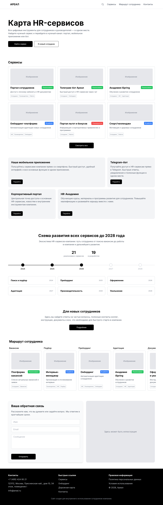

# HR Services Portal - прототип витрины HR‑сервисов

Прототип мобильного портала, который объединяет внутренние HR‑сервисы
промышленной компании в одном интерфейсе.

Основная задача проекта - упростить навигацию между корпоративными
сервисами и повысить осведомленность сотрудников о существующих цифровых
инструментах.

**Демо проекта:**\
https://looch-studio-test-task.vercel.app/

---

# Контекст проекта

В крупных промышленных компаниях сотрудники используют множество
внутренних цифровых сервисов:

- HR‑порталы
- корпоративные боты
- внутренние веб‑системы
- мобильные приложения

Часто эти сервисы распределены по разным системам и точкам входа. Из‑за
этого сотрудники:

- не знают о существовании некоторых сервисов
- создают дублирующие запросы
- тратят время на поиск нужного инструмента

Цель прототипа --- создать **единую витрину сервисов**, где сотрудники
могут быстро увидеть:

- доступные сервисы
- сервисы в разработке
- будущие цифровые продукты

Интерфейс ориентирован на **быструю навигацию и понимание доступных
возможностей**, а не на детальное описание каждого сервиса.

---

# Основные требования

Ключевые требования из брифа:

**Mobile‑first интерфейс**\
Около 70% сотрудников пользуются сервисами со смартфона.

**Единый лендинг**\
Все HR‑сервисы должны быть представлены в одном месте.

**Понятная навигация**\
Пользователь должен быстро ориентироваться в доступных сервисах.

**Повышение осведомленности**\
Портал должен помочь сотрудникам узнать о существующих цифровых
инструментах.

**HR‑ориентированная структура**\
Контент и структура интерфейса ориентированы на сотрудников компании.

---

# Возможности интерфейса

- mobile‑first адаптивный интерфейс
- карточная структура для отображения сервисов
- разделение сервисов по статусу (доступны / в разработке /
  планируются)
- простая навигация и быстрый доступ к сервисам
- адаптация под мобильные устройства и десктоп

---

# Технологический стек

**Frontend**

- React
- TypeScript
- Vite
- Tailwind CSS

**Инструменты**

- ESLint
- PostCSS
- Autoprefixer

---

# Структура проекта

Пример упрощенной структуры:

    src
     ├─ components
     │   ├─ ServiceCard
     │   ├─ ServicesGrid
     │   └─ Layout
     │
     ├─ pages
     │   └─ Home
     │
     ├─ data
     │   └─ services.ts
     │
     ├─ styles
     │
     └─ main.tsx

Структура проекта ориентирована на:

- переиспользуемые UI‑компоненты
- разделение логики интерфейса и данных
- простую масштабируемость

---

# Установка и запуск

Установить зависимости:

    npm install

Запустить проект в режиме разработки:

    npm run dev

Собрать production‑версию:

    npm run build

Просмотреть production‑сборку:

    npm run preview

---

# Возможные улучшения

Если развивать проект дальше, можно добавить:

- интеграцию с API HR‑сервисов
- авторизацию сотрудников
- персонализацию сервисов
- поиск и фильтрацию
- аналитику использования сервисов

---

# Автор

Ярослав Чертов\
Frontend Developer

GitHub:\
https://github.com/Yaroslav-Chertov
